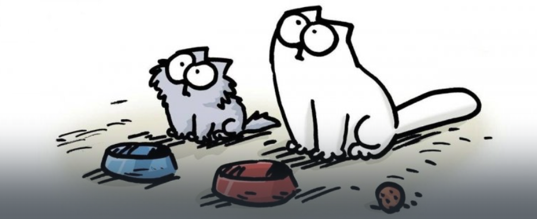

# Создание анимации в Blender

## Создание анимацию с двумя котами.

Первый котик сидит у миски и посматримает то на зрителя, то на миску.

Справа подходит большой кот и смотрит на маленького кота, потом на зрителя и снова на маленького кота.

**Пример:** ( Кот Саймона / Simon's Cat )

**Преподаватель:** Дуплей Максим Игоревич

**Студент:** Данилов Георгий Алексеевич
 
**Дата:** 25.09.2024
