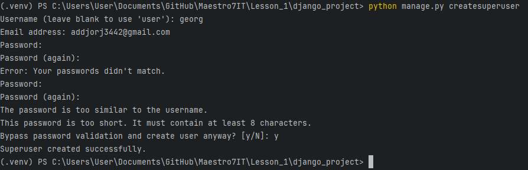

### Тема урока: Знакомство с фреймворками

### Список основных фреймворков:
1. Flet
2. FastAPI
3. Flask
4. Django

Django — это веб-фреймворк высокого уровня написанный на Python, который способствует быстрой разработке и чистому, прагматичному дизайну.

Он следует архитектурному шаблону Model-View-Template (MVT), который аналогичен Model-View-Controller (MVC).

### Как создать проект на Djngo:
1. Установка Django: pip install django
2. Создание базового проекта: django-admin startproject django_project
3. Запуск проекта: python manage.py runserver

Проверка новых данных: python manage.py makemigrations
Работа с базой данных: python manage.py migrate

Создание супер-пользователя: python manage.py createsuperuser

### Как создать проект на Flask:
1. Установка Flask: pip install flask
2. 2
3. 3

### Как создать проект на FastAPI:
1. Установка FastaPI: pip install fastapi
2. 2
3. 3

#### Преподаватель:  
#### Дата: 28.08.2024