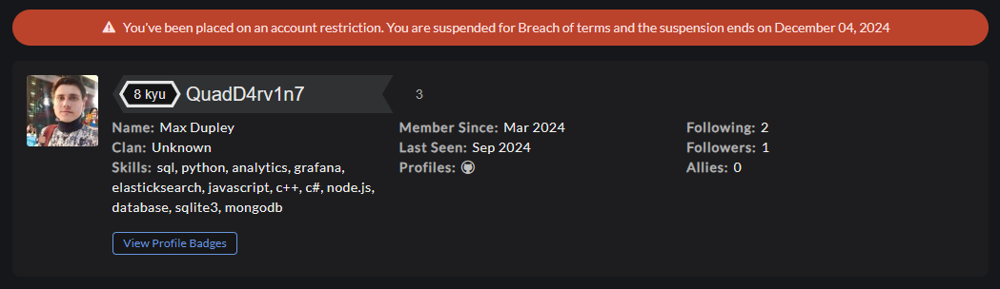

## Школа программирования Maestro7IT

### Решение заданий Kata Training с сайта Codewars
1. Convert to Binary (8 kyu)
2. Convert boolean values to strings 'Yes' or 'No'. (8 kyu)
3. Isograms (7 kyu)
4. Unique In Order (6 kyu)

5. String ends with? (7 kyu)
6. Reverse words (7 kyu)
7. Sum of Digits / Digital Root (6 kyu)
8. Counting Duplicates (6 kyu)
9. Vowel Count (7 kyu)
10. Are they the "same"? (6 kyu)
11. Sort the odd (6 kyu)
12. Extract the domain name from a URL (5 kyu)

13. Split Strings (6 kyu) Д/З
14. String Incrementer (5 kyu)
15. Who likes it? (6 kyu)
16. You Can't Code Under Pressure #1 (8 kyu)
17. Exes and Ohs (7 kyu)
18. Is this a triangle? (7 kyu)
19. Equal Sides Of An Array (6 kyu)
20. Opposite number (8 kyu)
21. Categorize New Member (7 kyu)
22. Beginner Series #2 Clock (8 kyu)
23. How good are you really? (8 kyu)
24. Ones and Zeros (7 kyu)
25. Convert a Number to a String (8 kyu)
26. Playing with digits (6 kyu)

27. Simple Pig Latin (5 kyu)
28. The observed PIN (4 kyu)

29. Convert number to reversed array of digits (8 kyu)
30. Calculate BMI (8 kyu)
31. Find the smallest integer in the array (8 kyu)
32. Century From Year (8 kyu)

33. Function 1 - hello world (8 kyu)
34. Array.diff (6 kyu)
35. MakeUpperCase (8 kyu)
36. Abbreviate a Two Word Name (8 kyu)
37. Beginner - Reduce but Grow (8 kyu)
38. 2
39. 3

**Преподаватель:** Дуплей Максим Игоревич

**Студент:** Данилов Георгий Алексеевич

📱 Telegram: @quadd4rv1n7

📱 Number: +7-915-048-02-49

**Дата:** 28.08.2024
