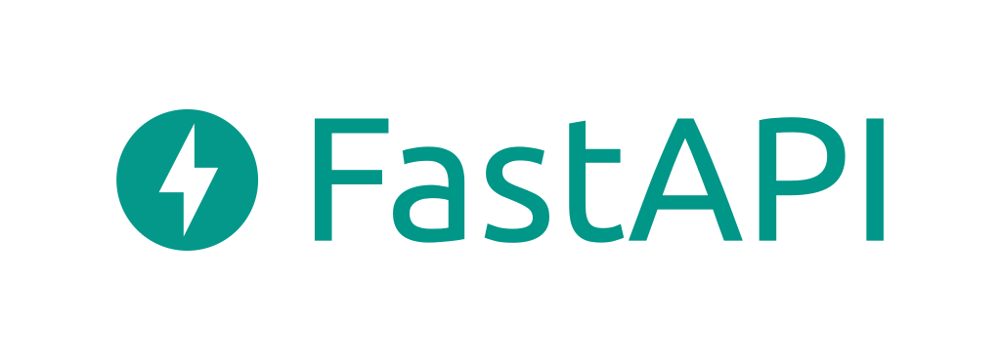

# Сайт CD обложек на Fast API 




## Описание проекта:

Создадим полноценное веб-приложение с использованием FastAPI и Bootstrap.

Мы будем использовать FastAPI для создания API и рендеринга HTML-шаблонов с помощью Jinja2 для отображения дисков PS4, Xbox, Nintendo ...

Bootstrap будет использоваться для стилизации нашего сайта.

## Структура проекта:
```
fast_api_cd_covers/
│
├── main.py                 # Основной файл приложения FastAPI
├── models.py               # Модели SQLAlchemy
├── schemas.py              # Pydantic схемы
├── crud.py                 # CRUD операции
├── database.py             # Подключение к базе данных
│
├── templates/              # Папка с HTML-шаблонами
│   ├── index.html           # Главная страница со списком игр
│   ├── game.html            # Страница подробной информации об игре
│   └── add_game.html        # Форма для добавления новой игры
│
├── static/                 # Папка со статическими файлами
│   ├── css/
│   │   └── bootstrap.min.css # Bootstrap CSS
│   └── js/
│       └── bootstrap.bundle.min.js # Bootstrap JS
│
├── requirements.txt        # Файл зависимостей
└── README.md               # Файл с описанием проекта
```

```
games - Это массив, содержащий объекты, каждый из которых представляет собой игру.
        id: Уникальный идентификатор игры.
        title: Название игры.
        genre: Жанр игры.
        release_year: Год выпуска игры.
        description: Краткое описание игры.
        photo_url: URL изображения обложки игры.
        music_url: URL аудиофайла с музыкой из игры.
        video_url: URL видеофайла с трейлером или другим видео о игре.
```

```
✔ Uncharted 4: A Thief’s End
✔ Horizon: Zero Dawn
✔ Detroit: Become Human
✔ Marvel’s Spider-Man
✔ Red Dead Redemption 2
✔ Ratchet & Clank
✔ Mass Effect: Legendary Edition
✔ Gran Turismo 7
✔ The Last Guardian™
✔ God of War
✔ Final Fantasy VII Remake
✔ Bloodborne
✔ Persona 5
```

### Запуск проекта

Установка зависимостей:
```
`pip install -r requirements.txt`
```

Запустите FastAPI приложение с помощью Uvicorn:
```
`uvicorn app.main:app # --reload`
```

Главная страница Fast API:
```
http://127.0.0.1:8000/docs
http://127.0.0.1:8000/games
http://127.0.0.1:8000/games/{game_id}
http://127.0.0.1:8000/games/{game_id}/delete
```

```
Теперь проект полностью готов и организован.
Вы можете запустить приложение и проверить его функциональность по указанным инструкциям.
```

**Преподаватель:** Дуплей Максим Игоревич

**Студент:** Данилов Георгий Алексеевич

**Дата:** 30.08.2024
