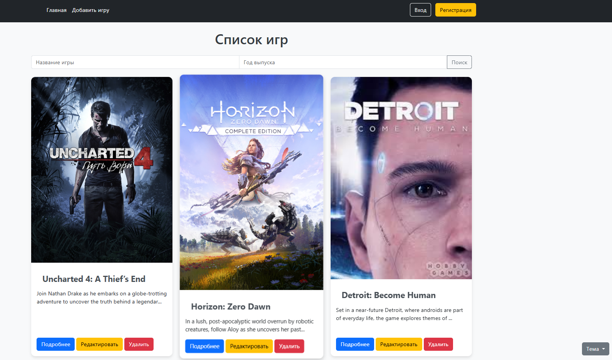
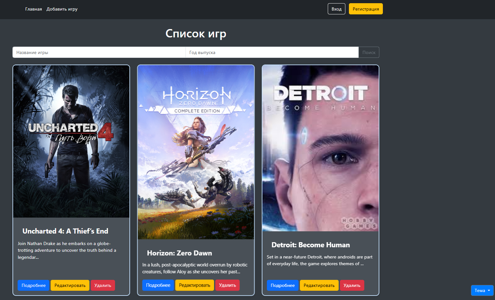
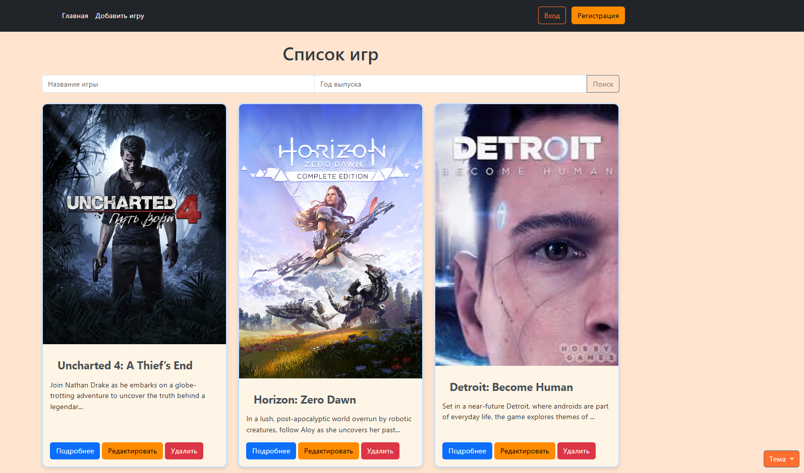
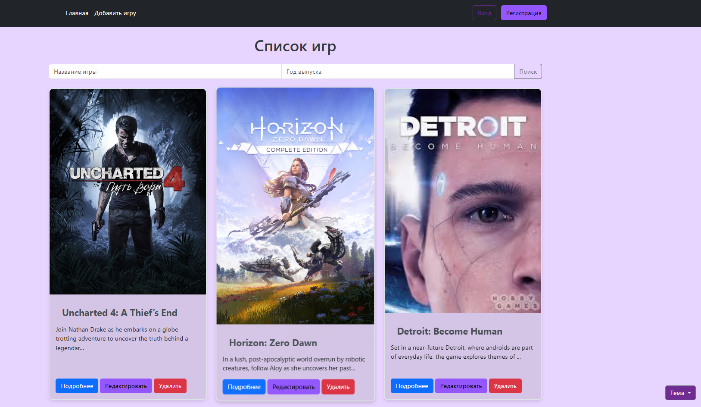
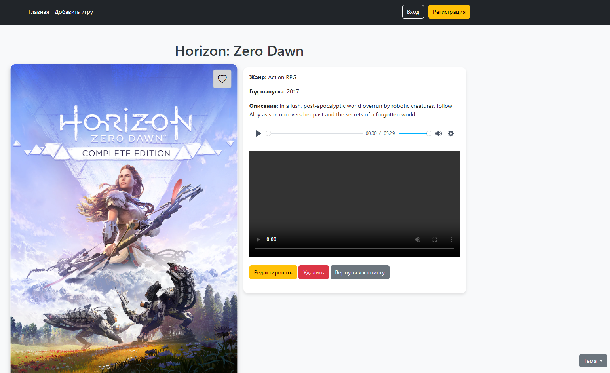

## Заметки по разработке проекта

### Дата: 20.10.2024

- Реализовали меню поиска по названию игры и дате выпуска
- Улучшения стилей для объектов и изображений
- Добавлена возможность комментирования проектов
- 4
- 5

### Дата: 03.11.2024

- Реализована возможность смены темы оформления (Светлая, Тёмная, Оранжевая, Фиолетовая)
- Улучшена возможность регистрации пользователя
- Написан функционал добавления в избранное
- 4
- 5

### Дата: 

- 1
- 2
- 3
- 4
- 5

### Идеи по улучшению проекта

- Возможность добавлять проект в избранное
- Оставлять оценку проекта по 10-звёздочной шкале
- Добавить анимацию к различным объектам (музыкальному-плееру, видео-плееру и карточкам проектов)
- Написать код страницы профиля пользователя
- Дописать код по комментариям, добавить возможность присылать фото и видео-комментарии
- 6
- 7
- 8
